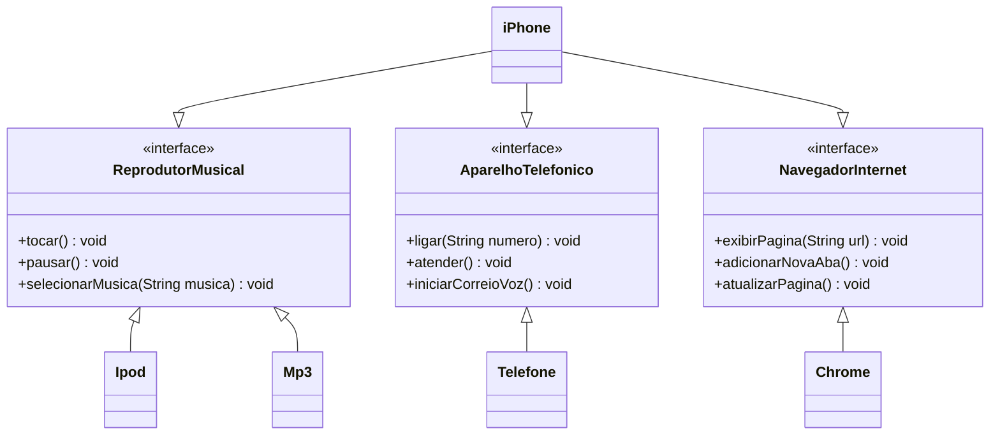

# POO - DESAFIO

## Modelagem e Diagramação de um Componente iPhone

### Contexto

Elaborar a diagramação das classes e interfaces utilizando uma ferramenta UML de sua preferência. Em seguida, implemente as classes e interfaces no formato de arquivos .java.

